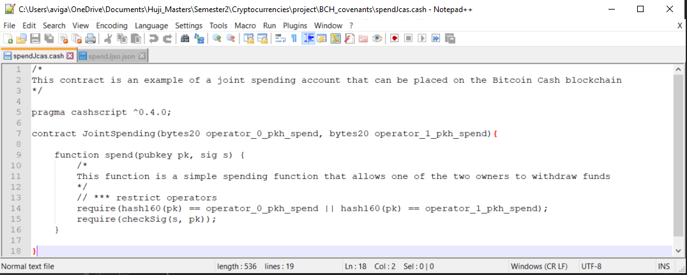
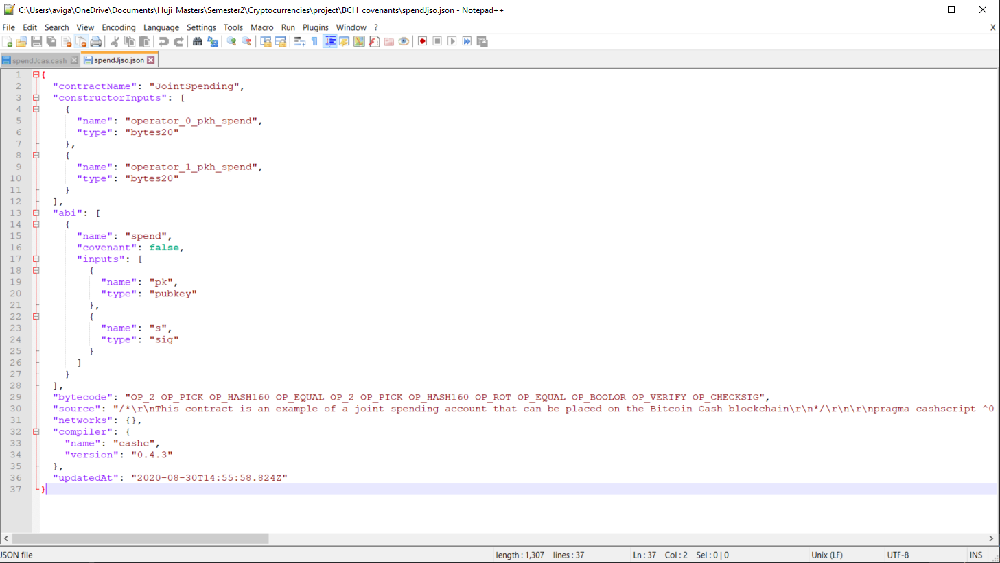

# covGen - smart contracts generator for Bitcoin Cash
> **Abstract:** *covGen is a program for creation and management of smart contracts on Bitcoin Cash (BCH).  Its command-line interface (CLI) allows the user to draft a smart contract, including covenants, compile it and then deploy it on the blockchain, as well as interact with it.*
>
> **Dependencies:** 

## Introduction
> Bitcoin contracts can restrict how much funds can be withdrawn from a contract, but as of today they cannot restrict who can withdraw those funds. Restricting what can be done with funds is what covenants are all about. A suggestion on how to implement covenants in bitcoin was presented in a paper titled ‘Bitcoin Covenants’ by Malte M¨oser, Ittay Eyal and Emin G¨un Sirer.[1]((https://maltemoeser.de/paper/covenants.pdf)). In order to make it work two new opcodes need to be added to the bitcoin operation codes.
>
> In 2017 bitcoin cash (BCH) hard forked from bitcoin (BTC), the reason being opcodes. Two opcodes that enable covenants in bitcoin cash are OP_CHECKSIG and OP_CHECKDATASIG. The added expressiveness of these opcodes allow for more expressive smart contracts, including covenants, in the bitcoin cash blockchain. From now on everything we will be discussing will be in BTH.
>
> Unlike with Ethereum contracts, in BTH contracts are not deployed on the blockchain but are defined by an cryptographed address unique to the contract. Funds can be sent to and received from the contract address. A contract contains functions with requirements, if all requirements are met, funds can be withdrawn from the contract.
>
> BTH has two main high-level programming languages for smart contracts, Spedn and cashScript. This project compiles a users desired contract to cashScript and from cashScript to the opcodes. We chose to work with cashScript because it is closer in form to solidity and we have learnt to use solidity in class.
>
> Our  covGen offers an abstraction layer over cashScript and provides an easy interactive platform to create and deploy covenants on BTH. In addition, covGen hides away most of the necessary yet troublesome code in JavaScript used for deployment and interaction with BCH smart contracts.

## Description
# TODO

## Usage
After cloning this repo and installing all dependencies, use the covGen program through `python3 covGen.py`

## Examples
> **Example 1 - Joint account:**
> 
> In this example our user will create a joint account where two public keys can have equal access to the funds in the contract.
> 
> At first run you will encounter a bit of information as tips
> 
>
> Then you will be asked to pick an option, would you like to create a new contract or make changes to an existing one?
> In this case we will pick 1 - ‘Create and compile a new smart contract’.
> 
>
> Now you will be asked for four inputs to start the contract, all parameters have default values so you can just press ‘enter’. 
> The parameters are:
> - A name for your contract, we will name our contract ‘JointSpending’, the default is ‘cov’.
> - cashScript pragma - From which cashScript version would you like your contract to run, we will just go with the default here by pressing ‘enter’.
> - Miner fee, in bitcoinCash the script will fail if the miner fee is too low. In optimised circumstances the miner fee would be calculated per byte,here we will go with the default.
> - And you have an option to enter a general comment about this function as you can see:
>
> 
>
> The covenant contract is a combination of one or more functions. If the author of the transaction can fulfill all the requirements he or she can withdraw the requested amount.
>
> 
>
> For this particular covenant we would like to create one function that allows two different people to spend funds.
>
> 
>
> In order to achieve our goal we must add a restriction. In our case we would like to restrict the allowed operators of the spending function, there will be 2 in total.
> 
>
> We will now be asked if we’d like to add restrictions to this function. We do not. The program will now ask us if we’d like to add another function to this covenant. We do not.
> 
>
> We now have an option to compile the scripted to opcodes for further deployment in the bitcoin cash blockchain. For that we need to enter two file names, one for the cashScript file and one for the jason file. 
> 
>
> We get the output in both specified files ‘spendJcash.cash’ and ‘spendJjson.json’. 
>
> The cash file looks as follows:
> 
>
> And the json file looks like this:
> 
>
> You can see that the source contract (the cashScript contract) is very long were the bytecode is a short and exact script

## References 
# TODO
## Disclaimer
> This project is a school project at the ‘Hebrew University in Jerusalem’.
The authors do not take responsibility for any malfunction or damage that may occur from a covenant generated in this platform.
Be smart and be careful!
>
>

