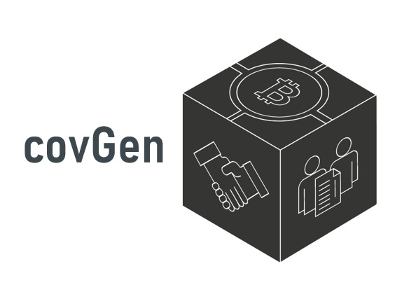
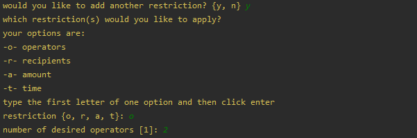

# covGen - Smart Contracts Generator for Bitcoin Cash
#### *covGen is a program for creation and management of smart contracts on Bitcoin Cash (BCH). Its command-line interface (CLI) allows the user to draft a smart contract, including covenants, compile it and then deploy it on the blockchain, as well as interact with it.*
  

 **Dependencies:** 


## Introduction
Bitcoin contracts can restrict how much funds can be withdrawn from a contract, but as of today they cannot restrict who can withdraw those funds. Restricting what can be done with funds is what covenants are all about. A suggestion on how to implement covenants in bitcoin was presented in a paper titled ‘Bitcoin Covenants’ by Malte M¨oser, Ittay Eyal and Emin G¨un Sirer<sup>[1](https://maltemoeser.de/paper/covenants.pdf)</sup>. In order to make it work two new opcodes need to be added to the bitcoin operation codes.\

In 2017 bitcoin cash (BCH) hard forked from bitcoin (BTC), the reason being opcodes. Two opcodes that enable covenants in bitcoin cash are OP_CHECKSIG and OP_CHECKDATASIG. The added expressiveness of these opcodes allow for more expressive smart contracts, including covenants, in the bitcoin cash blockchain. From now on everything we will be discussing will be in BTH.

Unlike with Ethereum contracts, in BTH contracts are not deployed on the blockchain but are defined by an cryptographed address unique to the contract. Funds can be sent to and received from the contract address. A contract contains functions with requirements, if all requirements are met, funds can be withdrawn from the contract.

BTH has two main high-level programming languages for smart contracts, Spedn and cashScript. This project compiles a users desired contract to cashScript and from cashScript to the opcodes. We chose to work with cashScript because it is closer in form to solidity and we have learnt to use solidity in class.

Our covGen offers an abstraction layer over cashScript and provides an easy interactive platform to create and deploy covenants on BTH. In addition, covGen hides away most of the necessary yet troublesome code in JavaScript used for deployment and interaction with BCH smart contracts.

## Description
The covGen is a command line interface run by python that generates covenants and smart contract for the bitcoin cash blockchain.
### Features:
 - **Smart contract creation:**\
 This aspect of the contract generator allows for a variety of restrictions 
   - **Operators:**\
   An *operator* of a function is someone who is allowed to use (call) it. 
   Their public key and signature will be verified upon calling the function.\
   If a function is composed solely of an operators restriction, then
   these operators may create a transaction that calls this function and spend the contract's funds freely.
   - **Recipients:**\
   A *recipient* of a function is someone that appears as one of the transaction's output.
   Recipients may be public keys (P2PKH) or a contract addresses (P2SH).
   If a PKH recipient is required to sign, it means that only a recipient can call this function.\
   If a function is composed solely of a recipients restriction, and without requiring their signatures, then anyone can create any transaction given that the output is (either one of, or all of) the pre-defined recipients.
     - Any or all: It is possible to allow any one of the recipients to get the funds, or demand that a withdrawal be divided equally between all recipients every time this function is called\
   - **Amount**\
   The amount of money in the transaction (in satoshis) can be restricted per transaction, per a recipient, or both.
   - **Time**\
    The time of the transaction can be restricted to be within a certain period
      - 'time' vs 'age':\
        It is possible to use either a relative time restriction (tx.age), or an absolute one (tx.time). 
        Note that due to limitations in the Bitcoin script time can only be used with the MIN option, age can be used with MIN or MAX.
        'time' and 'age' can be either a block number or a time stamp
      - 'min' vs 'max':\
        If min is defined, then the funds must be pulled after the TIME specified\
        If max is defined, the funds must be pulled before the TIME specified.
 - **Interaction with deployed contracts**

## Usage
After cloning this repo and installing all dependencies, use the covGen program through `python3 covGen.py`

## Examples
 **Example 1 - Joint account:**
 
 In this example our user will create a joint account where two public keys can have equal access to the funds in the contract.
 
 At first run you will encounter a bit of information as tips\
 

Then you will be asked to pick an option, would you like to create a new contract or make changes to an existing one.\
In this case we will pick 1 - ‘Create and compile a new smart contract’.\


Now you will be asked for four inputs to start the contract, all parameters have default values so you can just press ‘enter’.\
The parameters are:
 - A name for your contract, we will name our contract ‘JointSpending’, the default is ‘cov’.
 - cashScript pragma - From which cashScript version would you like your contract to run, we will just go with the default here by pressing ‘enter’.
 - Miner fee, in bitcoinCash the script will fail if the miner fee is too low. In optimised circumstances the miner fee would be calculated per byte,here we will go with the default.
 - A general comment about this function to assist in understanding what it is about.


The covenant contract is a combination of one or more functions. If the author of the transaction can fulfill all the requirements he or she can withdraw the requested amount.\


For this particular covenant we would like to create one function that allows two different people to spend funds.\


In order to achieve our goal we must add a restriction. In our case we would like to restrict the allowed operators of the spending function, there will be 2 in total.\


We will now be asked if we’d like to add restrictions to this function. We do not. The program will now ask us if we’d like to add another function to this covenant. We do not.\


We now have an option to compile the scripted to opcodes for further deployment in the bitcoin cash blockchain. For that we need to enter two file names, one for the cashScript file and one for the jason file.\


We get the output in both specified files ‘spendJcash.cash’ and ‘spendJjson.json’.\
The cash file looks as follows:
```
/*
This contract is an example of a joint spending account that can be placed on the Bitcoin Cash blockchain
*/

pragma cashscript ^0.4.0;

contract JointSpending(bytes20 operator_0_pkh_spend, bytes20 operator_1_pkh_spend){

	function spend(pubkey pk, sig s) {
		/*
		This function is a simple spending function that allows one of the two owners to withdraw funds
		*/
		// *** restrict operators
		require(hash160(pk) == operator_0_pkh_spend || hash160(pk) == operator_1_pkh_spend);
		require(checkSig(s, pk));
	}
}
```

And the json file looks like this:
```
{
  "contractName": "JointSpending",
  "constructorInputs": [
    {
      "name": "operator_0_pkh_spend",
      "type": "bytes20"
    },
    {
      "name": "operator_1_pkh_spend",
      "type": "bytes20"
    }
  ],
  "abi": [
    {
      "name": "spend",
      "covenant": false,
      "inputs": [
        {
          "name": "pk",
          "type": "pubkey"
        },
        {
          "name": "s",
          "type": "sig"
        }
      ]
    }
  ],
  "bytecode": "OP_2 OP_PICK OP_HASH160 OP_EQUAL OP_2 OP_PICK OP_HASH160 OP_ROT OP_EQUAL OP_BOOLOR OP_VERIFY OP_CHECKSIG",
  "source": "/*\r\nThis contract is an example of a joint spending account that can be placed on the Bitcoin Cash blockchain\r\n*/\r\n\r\npragma cashscript ^0.4.0;\r\n\r\ncontract JointSpending(bytes20 operator_0_pkh_spend, bytes20 operator_1_pkh_spend){\r\n\r\n\tfunction spend(pubkey pk, sig s) {\r\n\t\t/*\r\n\t\tThis function is a simple spending function that allows one of the two owners to withdraw funds\r\n\t\t*/\r\n\t\t// *** restrict operators\r\n\t\trequire(hash160(pk) == operator_0_pkh_spend || hash160(pk) == operator_1_pkh_spend);\r\n\t\trequire(checkSig(s, pk));\r\n\t}\r\n\r\n}\r\n",
  "networks": {},
  "compiler": {
    "name": "cashc",
    "version": "0.4.3"
  },
  "updatedAt": "2020-08-30T14:55:58.824Z"
}
```

You can see that the source contract (the cashScript contract) is very long were the bytecode is a short and exact script

**Example 2 - Joint account with amount limit:**
In this example we will not go through all the steps, but we will 
 
## References 
# TODO
## Disclaimer
This project is a school project at the ‘Hebrew University in Jerusalem’.
The authors do not take responsibility for any malfunction or damage that may occur from a covenant generated in this platform.
Be smart and be careful!
##### Contact us:
roei.yehuda@mail.huji.ac.il\
avigail.suna@mail.huji.ac.il


